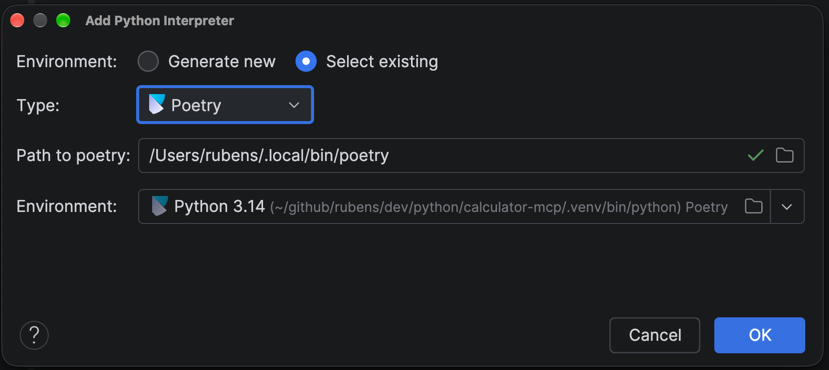
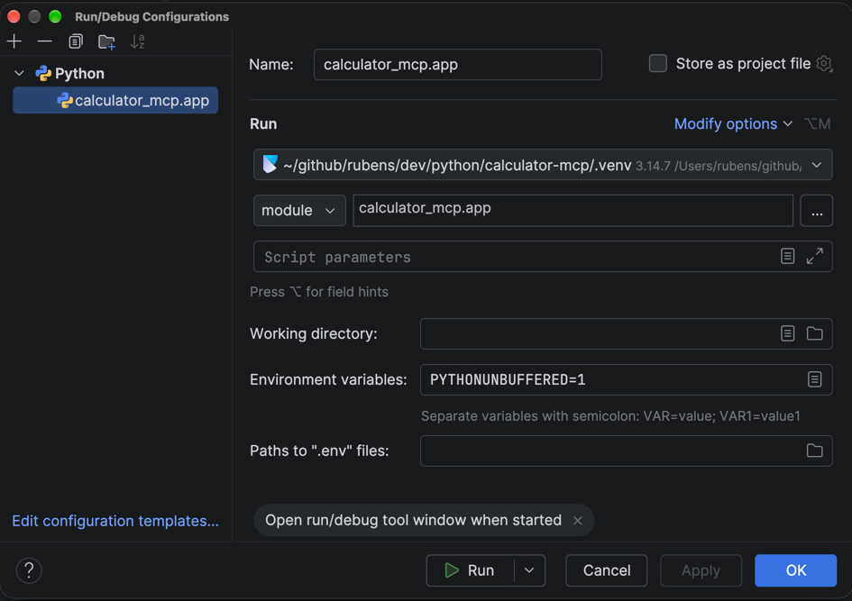
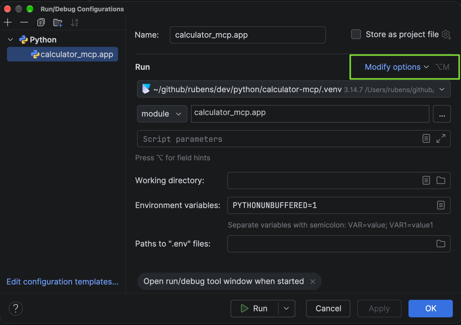
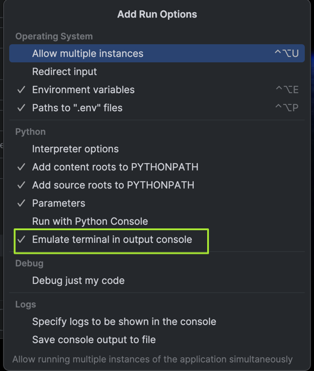

# PyCharm

This file contains handy information about working with the `pycharm` IDE.

## PyCharm Version

```text
PyCharm 2026.2.3
Build #PY-262.10968.92, built on September 18, 2026
Source revision: eea96f98b1a38
Runtime version: 25.0.4+1-b508.27 aarch64
VM: OpenJDK 64-Bit Server VM by JetBrains s.r.o.
Toolkit: sun.lwawt.macosx.LWCToolkit
macOS 27.0.1
Exception reporter ID: 2026-09-19_270eb0b4-3d1a-4245-9a0b-bb79fce805cf
JCEF version: 144.0.15-262-b37
GC: G1 Young Generation, G1 Concurrent GC, G1 Old Generation
Memory: 2048MiB
Cores: 14
Metal Rendering is ON
Registry:
  ide.experimental.ui=true
  trace.state.event.service.url=https://api.jetbrains.cloud/trace-status
  code.provenance.chatter.analytics.enabled=false
Non-Bundled Plugins:
  idea.plugin.protoeditor (262.10968.75)
  com.anthropic.code.plugin (0.1.14-beta)
```

## PyCharm IDE Development Environment

- First, follow the steps in
  [Development Setup](./DEVELOPMENT_SETUP.md) to ensure you have a proper
  development environment setup.

### Clone and Install

- clone project and run a local install

    ```bash
    git https://github.com/rubensgomes-org/math-ai-agent.git
    cd math-ai-agent
    poetry install
    ```

### Python Interpreter

1. Open the project `<proj-name>`  using `pycharm`
2. On the right bottom corner click on `<no interprete>`
3. Select `Add New Interpreter`  and `Add  Local Interpreter..`
4. `Select existing` and hit `Ok`

**NOTE**: the images displayed could be from a different project. However,
the procedures are still the same.



5. Open `PyCharm` > `Terminal` to go to venv prompt, and vefiry virtual
   environment and installed packages

```bash
poetry env info
poetry show
```

More details at
[Create a Poetry environment](https://www.jetbrains.com/help/pycharm/poetry.html#poetry-env)

### Edit Configurations

1. Menu: `Run` -> `Edit Configurations...`
2. Click: `+`, and select `Python`
3. Select: `module` from the `script/module` drop-down menu
4. Enter the module that has the `main` function (e.g.,
   `math_ai_agent.app`), and hit `OK`.

**NOTE**: the images displayed could be from a different project. However,
the procedures are still the same.



### Turn on Terminal Emulation

**NOTE**: the images displayed could be from a different project. However,
the procedures are still the same.

You need terminal emulation to hit `CNTL+C` to stop application
from wihing runing `pycharm` console.

1. Menu: `Run` -> `Edit Configurations...`
2. Click on the link `Modify options`

**NOTE**: the images displayed could be from a different project. However,
the procedures are still the same.



3. Ensure `Emulate terminal in output console` is selected.

**NOTE**: the images displayed could be from a different project. However,
the procedures are still the same.



### Debug `main` Module

Once the above "Edit Configurations in PyCharm" steps are complete:

1. Menu: `Run` -> `Debug...`
2. Select `main` module and `Debug`
