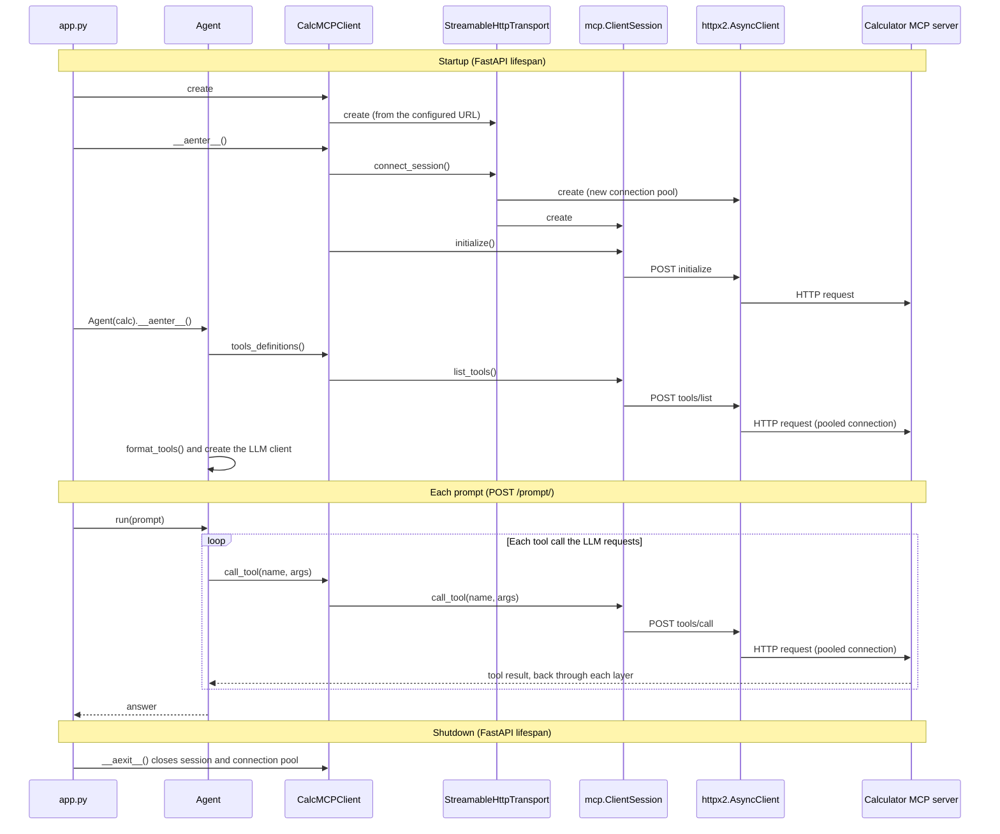

# MCP Client Sequence Diagram

When the MCP client classes are created, and how they interact at runtime.
The same diagram, for Lucidchart or draw.io, is in `mcp_sequence.drawio`.

This project's source code and documentation were generated with the
assistance of Artificial Intelligence (AI). For more information, please
refer to the `AI_DISCLAIMER.md` document located in the project's root
directory.

